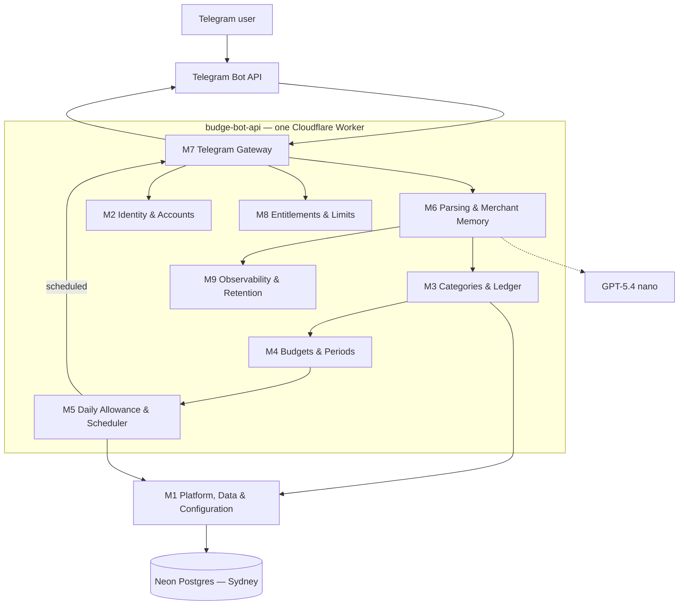

# Budge Bot — Master Execution Plan for a Claude Code Agent Team

**Source:** Notion → Business plans → Budgeting Bot → Technical Designs (fetched 5 Sep 2026; reconciled against Ricky's review comments on M1–M6, same date)
**Prepared for:** running M1–M11 as a parallel Claude Code agent team, coordinated through git worktrees
**Companion docs:** `M1-...md` through `M11-...md` in this folder — one execution plan per module

**Reconciliation note (5 Sep, fifth pass):** M1–M6 have **no open product questions left** (closed as of round 4). Round 5 brings M7 and M11 into the reconciliation for the first time since the initial pass: Ricky's finished his own edits to M11 in Notion, the biggest of which is **marking `/export` deferred (Story 7)** — full-history CSV export is out of scope for this build, joining `/history` interactive editing and the billing commands as a stub. That ripples into M3 (`exportCsv`), M2 (`exportAccount`), M7 (stub the command), and the master plan's scope/DoD — all updated (§5.8). M11's own page was also checked for drift against decisions resolved earlier in this conversation (monthly-only cycle, fixed 07:00 no-custom-time reminders, 5-step onboarding, "Food"-only starter, M3's archive mechanism) — M11's page still shows some of these as open, which is stale; this plan builds against the resolved answers. M7's Notion page is unedited since 4 Sept, so the only work there was applying M11's `/export` change — the routing-order reconciliation from the first pass already stands (§5.3).

---

## 1. Readiness verdict

**Yes, this is buildable by an agent team** — it's an unusually well-specified design set. Nine of eleven modules are marked Agreed with concrete schemas, TypeScript interfaces, and named invariants. But three things would trip up parallel agents working from the Notion pages alone, because the pages contain real, acknowledged gaps rather than settled answers:

1. **M3 (category removal/merge contract)** — needed for tier-downgrade cleanup, not fully specified in the original page. **Now resolved: archive gated on no-transactions-in-the-current-cycle** (§5.1).
2. **M5 (per-category allowance schema)** — the current schema and interface predate the 5 Sept multi-category-budget decision and needed revision. **Now resolved: bundled delivery, 07:00 default** (§5.2).
3. **M7 vs M11 (command routing order)** — M11 (5 Sept) proposed a routing precedence that reverses what M7 (4 Sept) documented, and said so explicitly. **Now resolved: build to M11's order** (§5.3) — confirmed on a round-5 re-fetch of both live pages.

None of these block the whole build. §5 below now reflects Ricky's actual decisions rather than a recommended default, and flags what's still genuinely open — which, after round 5, is just command-name sign-off, Stars pricing, and a couple of low-stakes M7 engineering defaults (§5.4, M11's plan).

Two modules are intentionally thin and should stay that way for this pass:
- **M9** is a stub by design — only `parse_event` and the logging rules are fixed; metrics/retention/alerting wait for real traffic.
- **M11** is a documentation/contract module with no tables or deployable of its own — it's the shared reference every command-handling agent reads, not a build target.

**Billing (Telegram Stars checkout)** is explicitly deferred in M8 itself ("price undecided... billing implementation remains a separate milestone"). Treat `/upgrade`, `/subscribe` checkout, `/subscription` cancellation, and `/paysupport` as **Phase 2**, out of scope for the v1 alpha build. The *policy* side of M8 (message quotas, category/reminder capacity checks) is in scope now — Free tier needs it regardless of whether Premium can be purchased yet.

---

## 2. System recap

One Cloudflare Worker (`budge-bot-api`) holds the whole product. Only Telegram is in scope; a second channel is a future adapter behind the same two ports (`InboundMessage`, `MessageSender`), never a reason to touch core modules today.

M10 (marketing site) is a **separate deployable and repo** — an Astro site already live at `budge-bot-site.pages.dev`. It has no runtime dependency on the Worker beyond a `t.me` deep link, so it's an independent track.

**Module rules that bind every agent, from M1:**
1. Dependencies point inwards — the gateway depends on the core, never the reverse.
2. A table has exactly one owning module. Other modules call that module's service; nobody writes another module's table directly.
3. Platform contact is confined to the edges — domain code takes an injected `Clock` and a repository interface, never `Date.now()` or a raw DB handle.

---

## 3. Scope for this build pass (v1 Telegram alpha)

**In scope:**
- M1 full platform setup — **single environment (production only) for this pass**, see §5.7
- M2 full — onboarding collects a budget start date, multiple categories+caps (one pre-seeded starter, "Food"), and per-tier reminder selection in one flow, **5 steps** (revised, see M2's plan — step count is a live question back to Ricky, see §5.6)
- M3 full **except** the full category removal/merge contract (see §5.1, resolved) and **`exportCsv`/`/export`, now deferred** (round 5, see §5.8)
- M4 full, **monthly only** (round 2's three-period-type expansion is reverted, see §5.4a)
- M5 full, revised for per-category **target persistence with bundled delivery** at a 07:00 local default (see §5.2)
- M6 full hybrid parser + merchant memory
- M7 full transport layer, built to **M11's revised routing order** (see §5.3) — not yet updated for the M5/M4 changes above, will need another pass once Ricky finishes M7/M11
- M8 **policy only**: message quotas, category/reminder capacity, requested-downgrade validation logic. No Stars checkout.
- M9 fixed pieces only: `parse_event` table + the logging rules. No dashboards, no retention job yet.
- M10 finish the two outstanding follow-ups (real bot link, `/support` deep link) — independent track
- M11 finalize as the command contract; drive its own open-decision table to closure (mostly your calls, see §5.4) — currently being updated by Ricky in parallel with M7

**Explicitly out of scope for this pass:**
- WhatsApp or any second channel
- Telegram Stars checkout, `/upgrade`/`/subscribe` payment flow, `/subscription` cancellation, `/paysupport` — build the commands as stubs that return "not yet available" rather than wiring real payment
- Interactive `/history` editing (Premium-gated, still open) — ship `/export` (CSV) only
- Custom reminder times (single fixed 07:00 default, no per-user or per-category override), Excel export
- M9 metrics/dashboards/alerting/retention jobs
- Multiple transactions in one message (ask the user to split them) — confirmed
- A dedicated staging environment / separate staging bot token — confirmed out of scope for this pass, see §5.7
- **`/export` (full-history CSV export) — deferred, round 5 (Story 7)** — build it as a stub returning "not yet available" only; see §5.8

---

## 4. Build sequencing

The schema has a real coupling that isn't obvious from reading one module page at a time: **M3's `transaction` table has a foreign key into M4's `budget_period`, and M4's `budget` table has a foreign key into M3's `category`.** Two modules, two owning agents, one shared migration graph. Two consequences:

- **Split `db/schema.ts` into per-module files** (`db/schema/identity.ts`, `db/schema/category.ts`, `db/schema/budget.ts`, `db/schema/transaction.ts`, `db/schema/allowance.ts`, `db/schema/entitlement.ts`, `db/schema/observability.ts`, `db/schema/platform.ts`), barrel-exported from `db/schema/index.ts`. This is the single highest-leverage thing M1 can do to keep parallel agents from fighting over one file.
- **M3 and M4 should be treated as one coordinated workstream**, not two agents who never talk. Either one agent does both, or two agents share a worktree/branch until the schema is settled, then split into separate PRs for the service logic.

### Phase 0 — Platform & Contracts (sequential, do this first, one agent)
**M1.** Scaffold `budge-bot-api`, wrangler config, CI, per-module schema files, and — critically — commit the **already-specified TypeScript interfaces** from every module page (`IdentityService`, `LedgerService`, `BudgetService`, `DailyAllowanceService`, `EntitlementService`, `MessageSender`/`InboundMessage`) into `core/ports/` as typed stubs. This is what lets Phase 1 agents work genuinely in parallel: they implement against a contract that's already fixed, instead of inventing their own and reconciling later. Phase 0 must merge before Phase 1 branches.

### Phase 1 — Independent modules (parallel worktrees)
- **M2** Identity & Accounts
- **M6** NLP Parsing & Merchant Memory (fold M9's fixed pieces — `parse_event` + logging rule — into this agent's PR; it's too small to be its own workstream)
- **M8** Entitlements & Limits, policy only
- **M10** Static website (separate repo entirely — can run at any time)

### Phase 2 — Coupled core (parallel worktree pair, coordinate schema)
- **M3** Categories & Ledger
- **M4** Budgets & Periods — now also owns the period-*type* schema (monthly/fortnightly/weekly), see §5.4a. This is a bigger lift than originally scoped; don't assume M4 is the smaller half of the Phase 2 pair anymore.

**Note:** M2's onboarding now asks for budget start date + period type before it asks for categories (see M2's plan) — M2 doesn't need M4's *code* to exist yet (it just collects and hands off the values), but the M2 agent should read M4's finalized period-type contract before wiring that step, so the values it collects match what M4 actually expects.

### Phase 3 — Depends on Phase 2 landing, and on the §5.2 schema decision
- **M5** Daily Allowance & Scheduler

### Phase 4 — Integrator, last
- **M7** Telegram Gateway — wires M2/M6/M8 (quota gate) on the inbound side and M5 (scheduled sends) on the outbound side, following **M11**'s command catalogue and revised routing order. Can start scaffolding the webhook + dedup logic in Phase 1 against the Phase 0 interface stubs, but command-by-command wiring waits on the modules it calls.

**Not a coding agent:** M11 is a living contract, not a build task. Assign it to yourself or a "lead" session that reviews each module PR against the catalogue, updates it as commands land, and is the one who actually resolves the reconciliation-table items in §5.4 — a worker agent implementing M7 or M3 shouldn't be the one deciding tier policy.

---

## 5. Decisions needed before or during the build

### 5.1 M3 — category removal/merge contract (blocks: downgrade cleanup only) — resolved 5 Sep (round 4)
**Gap:** M8's requested-downgrade flow needs categories removed while preserving transaction/budget history; M3's original design only had archive (which keeps counting against capacity, so it can't satisfy a downgrade).
**Resolved — Ricky's final call:** a category can only be archived if it has **no transactions in the current budget cycle (period).** Any transaction in-period blocks the archive outright; the user has to wait for the next cycle. Once archived, it never counts toward capacity, regardless of history from earlier periods — no separate "zero transactions ever" carve-out and no month-scoped active-category-set are needed, because the gate lives entirely on the archive action itself. This closes the "add, transact, archive, rename, repeat" loophole (you can't archive something you've transacted against *this* cycle) while being more permissive than the round 2/3 candidates across cycle boundaries (a category used heavily last cycle but untouched this one can be freed immediately) — see M3's plan, "Category removal and the capacity loophole," and M8's plan for the capacity-check update this requires.
**Still deferred to Phase 2, unchanged:** real removal of a category *with* transaction history — someone with 200 transactions in "Coffee" who wants it gone without waiting for an empty cycle. In-bot downgrade for a category that fails the archive-eligibility check stays stubbed "not yet available."
**Build for this pass:** archive gated on no-transactions-this-period; capacity = count of non-archived categories.

### 5.2 M5 — per-category allowance schema — resolved: bundled delivery, 07:00 default
**Gap:** `daily_allowance_send` was one row per `(user_id, local_date)`; the 5 Sept tier decision means a user can have several budgeted categories with a reminder enabled on each (1 Free / 5 Premium).
**Resolved:** persist one target row per `(user_id, category_id, local_date)` (unchanged from the original recommendation — needed regardless of delivery shape, since an unreminded budgeted category still needs a correct `/today` figure). **Delivery is bundled**, not per-category: when a user's reminder time arrives, gather every reminder-eligible category's target for today into **one** message, send once, and mark all included rows delivered together. No custom reminder times — **every user gets a single fixed 07:00 local send** (moved from the earlier 08:00 default). Suppression was also considered and rejected: the reminder still sends even if the user already logged something before 07:00. The message itself should also state days remaining in the current period, per Ricky's comment.
**Ripple:** M2's `app_user.reminder_local_time` default changes from `'08:00'` to `'07:00'`; M11's `/remind` contract (currently documented as defaulting to 08:00) will need the same correction when Ricky updates it.

### 5.3 M7 vs M11 — command routing order (blocks: M7) — resolved, re-confirmed round 5
**Gap:** M7 (4 Sept) documented "clarification-in-progress beats a slash command." M11 (5 Sept) proposed the opposite — recognised commands/callbacks, and callback/pre-checkout/payment events, take precedence over a pending clarification, and explicitly said this "revises M7's current clarification-first ordering."
**Resolution:** M11 is the later, more detailed doc and explicitly claims precedence on this one point. **M7's plan is built to M11's routing order** — this was already true going into round 5. Everything else on the M7 page (webhook security, deduplication, reply formatting, outbound failure classification) stands unchanged — only the ordering of step 2 vs step 3 in M7's original routing section is superseded.
**Round 5: re-checked against a fresh fetch of both live Notion pages.** M11 has been edited further since the first pass (most notably, `/export` marked deferred — see §5.8); M7's own Notion page is untouched since 4 Sept (its `page_last_edited_at` predates M11's latest edit), so there's no new conflict to reconcile beyond the routing order already handled. M7's plan has been updated to add the `/export` stub alongside the existing billing-command stubs. This item is closed.

### 5.4 Genuinely open — needs your call, not an engineering default
- Final approval of the proposed command names/syntax (`/categories`, `/settings`, `/upgrade`, `/subscription`, `/cancel`) before they're registered with BotFather.
- Whether `/history` interactive editing stays Premium-gated (as proposed) or ships on both tiers.
- Telegram Stars price and its AUD approximation (explicitly deferred, needs live-pricing validation before Phase 2 starts).
- ~~Whether custom reminder times are available on Free, or Premium-only~~ — **resolved: no custom times, fixed 07:00 for everyone** (§5.2).
- ~~Weekly/fortnightly period support~~ — **resolved (round 3): monthly only.** Round 2 had put all three in scope; Ricky's reverted that — see §5.4a.

### 5.4a M4 — reverted to monthly only (round 3 — this section previously proposed three period types)
**Round 2** had Ricky deciding all three period types — monthly, fortnightly, weekly — would ship this pass, with a proposed `period_type`/`period_anchor_date` schema to support it (the design that used to live in this section).
**Round 3, reverted:** *"actually lets skip the complexity and only say that we can have a monthly budget."* M4 is monthly-only, full stop. The `period_type` column and the weekly/fortnightly branches of `periodFor` are dropped.
**What survives from round 2:** the anchor is still stored as a full `period_anchor_date` (the "budget start date" M2's onboarding collects) rather than reverting all the way to a bare `period_start_day` smallint — it derives the monthly start-day trivially (`anchorDate.day`, capped at 28) and is a more natural onboarding question. This is my call, not something Ricky explicitly confirmed either way — flag it if you'd rather go back to the original bare-smallint column.
**Ripple applied this pass:** M2's onboarding no longer has a period-*type* step (see M2's plan and §5.6 below on the resulting step-count question); M3's complexity argument for skipping month-scoped category sets no longer cites "three period types" as the reason (M3's plan, §5.1 above); M5's tests no longer reference "all three of M4's period types."

### 5.5 M2's onboarding — resolved, and restructured (round 3 update)
Ricky's answers, and a structural change to the flow itself:
- **Onboarding is now 5 steps** (was 4 originally, briefly 6 in round 2): timezone → currency → budget start date → fill in categories + caps (up to tier limits) → reminder category selection (1 Free / 5 Premium). It no longer stops at one category — it fills in as many as the user wants during onboarding. **Round 2's separate "budget period type" step is gone** now that M4 is monthly-only (§5.4a) — there's no real choice left to ask about. Ricky's round-3 message asked me to confirm this is still 6 steps; I can't confirm that honestly given the revert, so this is flagged again in §5.6 rather than silently forced back to 6.
- **Starter categories: "Food" only** (round 3: Rent/Mortgage and Utilities dropped — round 2 had all three).
- **Timezone picker: curated AU list + IANA search for everything else** — confirmed, with search now explicitly required (not deferred).
- **Onboarding latency target** stays "under 5 minutes" (relaxed from "under a minute" in round 2) — still longer than the original one-category flow even at 5 steps.
- **"Reset everything" on repeated `/start`: confirmed out of scope.** Round 2's ambiguous answer was a typo; Ricky's round-3 clarification: *"haha I meant lets put this out of scope for now."*

### 5.6 Open questions — none remaining on M1–M6 after round 4
Rounds 1–3 raised 5 questions; round 3 resolved 4 of them; round 4 closed the last two:
- ~~M3 — category-removal loophole, confirm the mechanism~~ — **resolved (round 4): archive gated on no-transactions-in-the-current-cycle; capacity = non-archived count.** See §5.1 and M3's plan.
- ~~M2 — onboarding step count~~ — **confirmed: 5 steps.** Ricky confirmed directly; the round-2 "budget period type" step stays dropped, matching M4's monthly-only revert.
- ~~M2 — "reset everything" on `/start`~~ — **confirmed out of scope**, was a double-negative typo (§5.5).
- ~~M3 — backdating floor~~ — **confirmed: account creation date** (M3's plan).
- ~~M4 — period-type schema approach~~ — **moot, reverted to monthly-only** (§5.4a). The remaining schema call (keep `period_anchor_date`, drop `period_type`) is mine, not Ricky's — flagged in M4's plan if he wants it reverted further.
- ~~M1 — "production only for now," fully~~ — **confirmed: single bot token, no staging, solo user for now** (§5.7).

M1–M6 have no open product questions left. What remains is M7/M11's routing-order conflict (§5.3), which waits on Ricky's own update pass on those two pages.

### 5.7 M1 — single environment for now (was: staging + production) — fully confirmed round 3
**Resolved:** Ricky's round-2 answer ("let's assume we only have production for now") was a bigger change than that one line implied, because M1's page (unedited elsewhere) still described **two full environments, each with its own Worker, Neon branch, and Telegram bot token**, specifically so a test message can never reach a real user. Dropping staging removes that safety net entirely.
**What this means concretely:** one Worker, one Neon branch (production), one Telegram bot token. Pre-merge testing relies on CI's per-PR ephemeral Neon branch (already part of M1's design, unrelated to "staging" as an environment) plus unit/integration tests — there's no deployed pre-prod Worker to poke at with a real Telegram client before a change ships.
**Round 3: fully confirmed, not an accidental scope-cut.** Ricky: *"confirm production only, I can't be bothered with staging too, considering I am the only user for now."* Single bot token, no separate test bot, no lightweight smoke-test path — this question is closed.

---

### 5.8 M11/M7 — `/export` marked deferred (new, round 5)
**Change:** Ricky's marked `/export` (Story 7, full-history CSV export) deferred in M11 — it's no longer being built this pass, despite having been in scope since the very first pass (both tiers, "existing baseline"). It joins `/history` interactive editing and the billing commands as a stub that returns "not yet available."
**Ripple applied this pass:** M3's `exportCsv` and M2's `exportAccount` are deferred (port method signatures kept so the contracts still compile; implementations skipped) — see both plans. M7 stubs `/export` the same way as `/upgrade`/`/subscribe`/`/subscription`/`/paysupport`. The master plan's scope (§3) and definition of done (§8) are updated accordingly.
**Not affected:** `/history`'s pagination/read path was never blocked on this — it was already deferred (interactive editing only); this doesn't change anything there.

---

## 6. Cross-cutting conventions (every agent must follow these — from M1 §5–6)

- `uuid` primary keys, `default gen_random_uuid()`.
- Every timestamp is `timestamptz` UTC; a user-local calendar date is a separate `date` column computed at write time.
- Money is `bigint` minor units. Never `numeric`, never a float, at any layer.
- Every user-scoped table carries `user_id` with `on delete cascade`.
- Uniqueness and conditional uniqueness are database constraints (partial unique indexes), not application checks.
- Enumerations are `text` with a `check` constraint, never a Postgres enum.
- Forward-only migrations via Drizzle Kit; generated SQL is committed and is the source of truth.
- Domain code (`core/domain`) is pure: an injected `Clock`, no `Date.now()`, no direct DB handle — this is what makes period/allowance maths unit-testable at arbitrary instants and across daylight-saving transitions.
- Test tiers: unit (pure domain, no DB), integration (against a real Neon branch — the constraints are doing real work, a mock wouldn't enforce them), eval (M6's versioned NLP set), end-to-end (one deployed-staging webhook round trip).

---

## 7. Coordinating the agents in practice

Given your existing psmux/worktree workflow: a permanent level-1 worktree for `budge-bot-api`, and a level-2 task worktree per module/phase, PR opened per module, reviewed sequentially as they land — same pattern you already use on Conduit.

**The real coordination mechanism here is the shared contract, not live agent-to-agent chat.** Separate Claude Code CLI sessions in separate worktrees can't talk to each other directly. What makes this workable anyway:
- Phase 0 fixes the TypeScript interfaces and the split schema files before anyone else starts — that *is* the communication channel between modules.
- Each module's plan doc (this folder) states exactly what it depends on and exactly what depends on it, so an agent handed `M6-...md` has everything it needs without waiting on a message from whoever's building M3.
- Keep a `docs/build-log.md` in the repo where each agent appends what it built, what it assumed, and any open question it hit — you read this between PR reviews the same way you already test PRs sequentially when you return.
- The three flagged gaps (§5.1–5.3) are exactly the cases where an agent working from the Notion page alone *would* need to guess — they're called out here precisely so nobody has to.

---

## 8. Definition of done for this pass

- [ ] `budge-bot-api` deploys to the single production Worker with its Neon branch and its Telegram bot token (no separate staging environment this pass — see §5.7).
- [ ] `/start` reaches a usable state (timezone → currency → budget start date → categories+caps → reminder selection) in under 5 minutes.
- [ ] A natural-language expense message is parsed, confirmed, and reflected in that day's allowance within the PRD's latency target.
- [ ] The morning cron delivers a correct, once-only **bundled** allowance message at 07:00 local per due user, covering every reminder-eligible category in one send.
- [ ] Monthly budget periods derive correctly from the anchor date, including at DST transitions.
- [ ] Free-tier quotas (5 messages/day, 20/2h, 10 categories, 1 reminder category) are enforced and correctly refused with the right retry-time messaging.
- [ ] `/export` is registered as a working stub returning "not yet available" (real CSV export deferred this pass, round 5 — see §5.8).
- [ ] `/delete`, category correction, and account deletion behave per each module's invariants.
- [ ] Unit tests cover period/allowance maths at boundaries and DST transitions; integration tests run against a real Neon branch in CI; the M6 eval set has a measured (not guessed) accuracy baseline.
- [ ] No bot token, webhook secret, or raw message text appears in logs or `parse_event`.
- [ ] M11's command catalogue reflects what was actually implemented, not what was originally proposed.

---

## 9. Module plan index

| # | Module | Status (Notion) | Phase |
|---|---|---|---|
| M1 | Platform, Data & Configuration | Agreed | 0 |
| M2 | Identity & Accounts | Agreed | 1 |
| M3 | Categories & Ledger | Agreed, resolved: §5.1 | 2 |
| M4 | Budgets & Periods | Agreed, monthly-only (reverted round 3, §5.4a) | 2 |
| M5 | Daily Allowance & Scheduler | Agreed, resolved: bundled/07:00 (§5.2) | 3 |
| M6 | NLP Parsing & Merchant Memory | Agreed | 1 |
| M7 | Telegram Gateway | Agreed, resolved: §5.3; `/export` stubbed (§5.8) | 4 |
| M8 | Entitlements & Limits | Agreed (policy); billing deferred | 1 |
| M9 | Observability, Privacy & Retention | Stub by design | fold into M6 |
| M10 | Static Website & Conversion Flows | Partially live | independent |
| M11 | Telegram Commands & Contracts | Draft, reconciled round 5 — reference doc, not a build target | ongoing/lead |

See `M<N>-*.md` for each module's full execution plan: dependencies, schema, interface, task checklist, invariants, tests, and explicit out-of-scope items.
